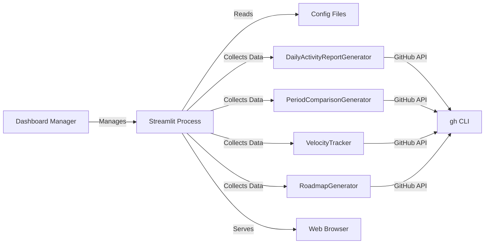
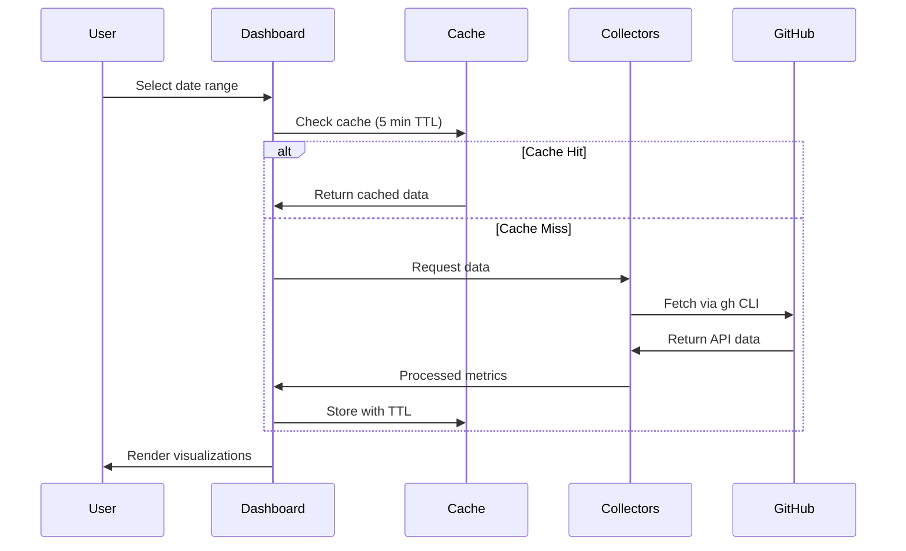

# Dashboard Documentation

The GitHub PM Dashboard provides real-time visualization of project metrics, activity trends, and milestone health across all configured repositories.

## Overview

The dashboard is built with Streamlit, offering an interactive web interface for exploring:
- Commit activity and trends
- Issue tracking and velocity
- Repository health metrics
- Milestone progress and predictions
- Work distribution patterns

## Architecture



### Components

1. **Dashboard Manager** (`workflows/dashboard/dashboard_manager.py`)
   - Process lifecycle management (start, stop, restart)
   - PID tracking and health monitoring
   - Log aggregation

2. **Streamlit App** (`workflows/dashboard/app.py`)
   - Interactive web interface
   - Data collection and caching
   - Real-time metrics visualization

3. **Data Collectors**
   - `DailyActivityReportGenerator` - Activity metrics
   - `PeriodComparisonGenerator` - Trend analysis
   - `VelocityTracker` - Team velocity metrics
   - `RoadmapGenerator` - Milestone predictions

## Getting Started

### Prerequisites

- GitHub CLI (`gh`) installed and authenticated
- Python 3.11+
- UV package manager
- Configuration file at `config/collection/production.yaml`

### Quick Start

```bash
# Start the dashboard
uv run dashboard start

# Open browser to http://127.0.0.1:5000
```

The dashboard will start in the background and remain running until explicitly stopped.

## Commands

### Start Dashboard

```bash
# Start on default port (5000)
uv run dashboard start

# Start on custom port
uv run dashboard start --port 8080

# Start on specific host
uv run dashboard start --host 0.0.0.0 --port 8080
```

**Output:**
```
🚀 Starting dashboard server...
✅ Dashboard started successfully
   PID: 12345
   URL: http://127.0.0.1:5000
   Logs: /Users/you/workspace/github-pm/.dashboard.log
```

### Stop Dashboard

```bash
uv run dashboard stop
```

Gracefully shuts down the dashboard process (SIGTERM, then SIGKILL if needed).

### Restart Dashboard

```bash
# Restart with same settings
uv run dashboard restart

# Restart with new port
uv run dashboard restart --port 8080
```

Stops the current process and starts a new one.

### Check Status

```bash
uv run dashboard status
```

**Output:**
```
============================================================
Dashboard Status
============================================================
Status: ✅ Running
PID: 12345
URL: http://127.0.0.1:5000
Logs: /path/to/.dashboard.log
============================================================
```

### View Logs

```bash
# Show last 50 lines (default)
uv run dashboard logs

# Show last 100 lines
uv run dashboard logs --lines 100

# Follow logs in real-time
uv run dashboard logs --follow
```

## Dashboard Features

### Date Selection

**Sidebar controls for flexible time ranges:**

- **Presets:**
  - Today (last 24 hours)
  - Yesterday
  - Last 7 Days
  - Last 14 Days
  - Last 30 Days
  - Last 90 Days
  - Custom Range (date picker)

- **Refresh Button:** Clear cache and reload all data

### Activity Metrics (Row 1)

Four key metrics with trend indicators:

1. **Commits**
   - Total commits in selected period
   - Delta shows change vs previous period

2. **Issues Worked On**
   - Count of unique issues referenced in commits
   - Delta shows change vs previous period

3. **Active Repos**
   - Number of repositories with commits

4. **Code Quality**
   - Percentage of conventional commits
   - Measures adherence to commit standards

### Velocity & Roadmap Metrics (Row 2)

1. **Avg Issues/Week**
   - Rolling average over 6 cycles
   - Trend indicator (📈 improving, ➡️ stable, 📉 declining)

2. **Avg Commits/Week**
   - Rolling average over 6 cycles

3. **Total Milestones**
   - Count across all repositories

4. **Critical Milestones**
   - Count of overdue or at-risk milestones
   - Color-coded alert when > 0

### Work Distribution Chart

Bar chart showing commit breakdown by type:
- `feat` - New features
- `fix` - Bug fixes
- `docs` - Documentation
- `refactor` - Code refactoring
- `test` - Testing
- `chore` - Maintenance
- Other types as configured

### Repository Activity Table

Sortable table showing:
- Repository name
- Commit count for selected period
- Sorted by activity (most active first)

### Critical Milestones Section

Expandable cards for each milestone that is:
- **Overdue** (❌) - Past due date
- **At Risk** (🟠) - Velocity insufficient to meet deadline

Each card shows:
- Progress percentage and bar
- Completed vs total issues
- Days overdue or predicted days remaining
- Milestone description

## Data Flow



### Caching Strategy

Data is cached for 5 minutes (`@st.cache_data(ttl=300)`) to:
- Reduce GitHub API calls
- Improve response time
- Prevent rate limiting

Cache is automatically cleared:
- After 5 minutes
- When "Refresh Data" button is clicked
- When date range changes

## Configuration

### Application Settings

Configure in `workflows/dashboard/app.py`:

```python
# Page configuration
st.set_page_config(
    page_title="Dashboard",
    page_icon="📊",
    layout="wide",
    initial_sidebar_state="expanded",
)

# Cache TTL
@st.cache_data(ttl=300)  # 5 minutes
```

### Data Source Configuration

Dashboard reads from `config/collection/production.yaml`:

```yaml
repositories:
  - owner: your-org
    name: repo-1
  - owner: your-org
    name: repo-2

issue_state: all
limit: 1000
```

### Process Management

Dashboard manager stores runtime files in project root:
- `.dashboard.pid` - Process ID for lifecycle management
- `.dashboard.log` - Aggregated output logs

## Advanced Usage

### Custom Port and Host

```bash
# Bind to all interfaces (accessible from network)
uv run dashboard start --host 0.0.0.0 --port 8080

# Bind to specific IP
uv run dashboard start --host 192.168.1.100 --port 8080
```

### Running in Production

For production deployment:

1. **Use a reverse proxy** (nginx, caddy):
   ```nginx
   location /dashboard {
       proxy_pass http://127.0.0.1:5000;
       proxy_http_version 1.1;
       proxy_set_header Upgrade $http_upgrade;
       proxy_set_header Connection "upgrade";
   }
   ```

2. **Enable authentication** in Streamlit:
   ```toml
   # .streamlit/config.toml
   [server]
   enableCORS = false
   enableXsrfProtection = true
   ```

3. **Use systemd for process management**:
   ```ini
   [Unit]
   Description=GitHub PM Dashboard

   [Service]
   Type=simple
   User=your-user
   WorkingDirectory=/path/to/github-pm
   ExecStart=/usr/local/bin/uv run dashboard start
   Restart=always

   [Install]
   WantedBy=multi-user.target
   ```

### Multiple Dashboard Instances

Run multiple dashboards on different ports:

```bash
# Development dashboard
uv run dashboard start --port 5000

# Staging dashboard (different terminal)
uv run dashboard start --port 5001

# Production dashboard (different terminal)
uv run dashboard start --port 5002
```

Note: Each instance creates its own PID file, so only one can use the default `.dashboard.pid`. Consider modifying the manager for multi-instance support.

## Troubleshooting

### Dashboard Won't Start

**Error:** "Dashboard is already running"

```bash
# Check status
uv run dashboard status

# Stop existing instance
uv run dashboard stop

# Start fresh
uv run dashboard start
```

**Error:** "Port already in use"

```bash
# Use different port
uv run dashboard start --port 5001

# Or find and kill process on port
lsof -ti:5000 | xargs kill -9
```

### No Data Showing

1. **Check configuration file exists:**
   ```bash
   ls config/collection/production.yaml
   ```

2. **Verify GitHub CLI is authenticated:**
   ```bash
   gh auth status
   ```

3. **Check dashboard logs:**
   ```bash
   uv run dashboard logs --lines 100
   ```

4. **Clear cache and refresh:**
   - Click "Refresh Data" button in sidebar
   - Or restart dashboard: `uv run dashboard restart`

### Slow Performance

1. **Reduce date range** - Shorter periods load faster
2. **Limit repositories** in config file
3. **Increase cache TTL** in `app.py`:
   ```python
   @st.cache_data(ttl=600)  # 10 minutes
   ```

### Memory Issues

Streamlit caches data in memory. For large datasets:

1. **Restart periodically:**
   ```bash
   # Add to crontab for daily restart
   0 2 * * * cd /path/to/github-pm && uv run dashboard restart
   ```

2. **Reduce cache TTL** to free memory faster

3. **Limit data collection** in workflow configs

## Architecture Decisions

### Why Streamlit?

Streamlit was chosen over Flask for several reasons:

1. **Pure Python** - No HTML/CSS/JS required
2. **Built-in caching** - Automatic data caching with TTL
3. **Reactive UI** - Automatic re-rendering on state changes
4. **Native widgets** - Date pickers, metrics, charts out-of-the-box
5. **Faster development** - 350 lines vs 400+ lines of templates
6. **Better for data apps** - Designed for data visualization

### Why Background Process?

The dashboard manager runs Streamlit as a background process (like pm2) because:

1. **Persistent service** - Survives terminal closure
2. **Easy management** - Simple start/stop/restart commands
3. **Log aggregation** - Centralized logging
4. **Health monitoring** - PID-based process tracking
5. **Production-ready** - Suitable for server deployment

## Extending the Dashboard

### Adding New Metrics

1. **Create data collection function:**
   ```python
   @st.cache_data(ttl=300)
   def load_custom_data(since_str, until_str):
       # Your data collection logic
       return data
   ```

2. **Add to main section:**
   ```python
   custom_data = load_custom_data(since, until)

   if custom_data:
       st.metric("Custom Metric", custom_data["value"])
   ```

### Adding New Visualizations

```python
# Line chart
st.line_chart(dataframe)

# Area chart
st.area_chart(dataframe)

# Map
st.map(dataframe)

# Custom plotly chart
import plotly.express as px
fig = px.scatter(dataframe, x="x", y="y")
st.plotly_chart(fig)
```

### Adding New Pages

Create multi-page app structure:

```
workflows/dashboard/
├── app.py                    # Main page
└── pages/
    ├── 1_Activity.py        # Activity details
    ├── 2_Velocity.py        # Velocity analysis
    └── 3_Milestones.py      # Milestone tracking
```

Streamlit automatically detects pages in the `pages/` directory.

## Integration with Workflows

The dashboard integrates with all workflow modules:

- **Code Analysis** (`workflows/code_analysis/`)
  - `DailyActivityReportGenerator`
  - `PeriodComparisonGenerator`

- **Metrics** (`workflows/metrics/`)
  - `VelocityTracker`

- **Planning** (`workflows/planning/`)
  - `RoadmapGenerator`

All collectors follow the same pattern:
1. Load config from `config/collection/production.yaml`
2. Fetch data via GitHub CLI
3. Process and return structured data
4. Handle errors gracefully

## References

- [Streamlit Documentation](https://docs.streamlit.io)
- [Streamlit Caching](https://docs.streamlit.io/develop/concepts/architecture/caching)
- [Streamlit Deployment](https://docs.streamlit.io/deploy)
- [GitHub CLI Manual](https://cli.github.com/manual)

## Related Documentation

- `CLAUDE.md` - Project overview and commands
- `docs/MULTI_AGENT_WORKFLOW.md` - Multi-agent coordination
- `workflows/planning/STATUS_LABELS_GUIDE.md` - Status label setup
