# Multi-Agent Workflow Guide

## Overview

When multiple AI coding agents work concurrently across your codebase, coordination becomes critical. This guide establishes protocols for issue assignment, branch management, and conflict avoidance to enable safe parallel agent execution.

## Core Principle

**One Issue = One Branch = One Agent**

This isolation ensures agents can work simultaneously without stepping on each other's toes.

## The Multi-Agent Development Cycle

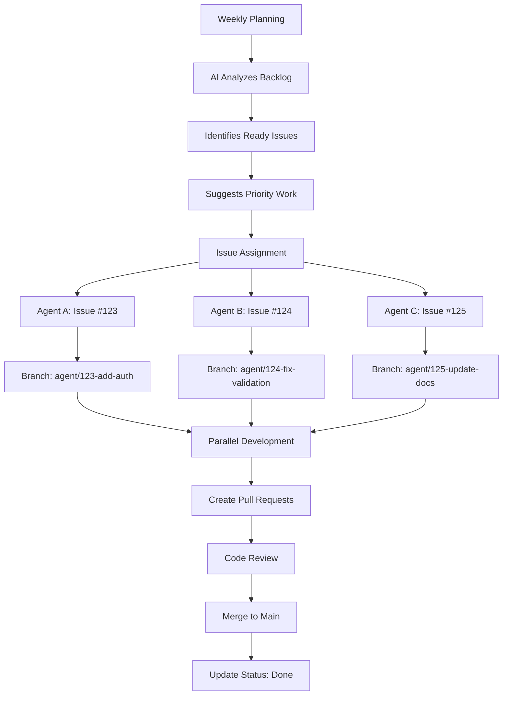

## Status Flow Through Agent Lifecycle

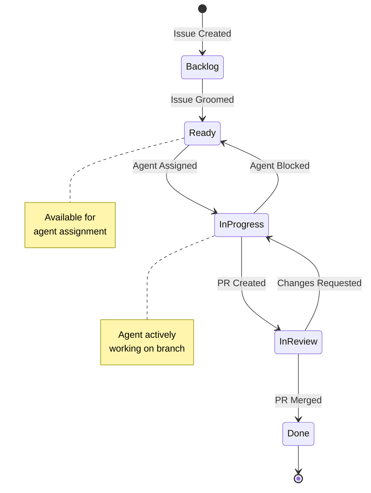

## Branch Naming Convention

### Standard Format
```
agent/{issue-number}-{short-description}
```

### Examples
```bash
agent/123-add-user-authentication
agent/124-fix-date-validation-bug
agent/125-update-api-documentation
agent/126-refactor-database-layer
```

### Why This Format?

1. **`agent/` prefix** - Clearly identifies automated agent work
2. **Issue number** - Direct traceability to GitHub issue
3. **Description** - Human-readable context at a glance
4. **Grep-able** - Easy to find all agent branches: `git branch | grep agent/`

## Agent Workflow Protocol

### Phase 1: Issue Selection & Assignment

```bash
# 1. Load issue context using slash command
/git:issue 123

# 2. Verify issue is ready for work
# Check status label: should be "status:ready"
# Check milestone: understand priority
# Check dependencies: no blockers

# 3. Create agent branch
git checkout main
git pull origin main
git checkout -b agent/123-add-user-authentication

# 4. Update issue status
gh issue edit 123 --remove-label "status:ready" --add-label "status:in progress"

# Optional: Add comment to track agent assignment
gh issue comment 123 --body "🤖 Agent started work on branch \`agent/123-add-user-authentication\`"
```

### Phase 2: Development

```bash
# Work on the issue
# - Make commits following Conventional Commits format
# - Reference issue number in commits
# - Keep scope limited to this issue only

# Example commits:
git commit -m "feat(auth): add login endpoint

Implements user authentication with JWT tokens.

Fixes #123"

git commit -m "test(auth): add login endpoint tests

Refs #123"

# Push regularly to track progress
git push -u origin agent/123-add-user-authentication
```

### Phase 3: Pull Request & Review

```bash
# Create PR linked to issue
gh pr create \
  --title "feat: Add user authentication (#123)" \
  --body "$(cat <<'EOF'
## Summary
Implements user authentication system with JWT tokens.

## Changes
- Added `/auth/login` endpoint
- Created `AuthService` class
- Added JWT token generation and validation
- Tests for all authentication flows

## Testing
- Unit tests: `pytest tests/test_auth.py`
- Integration tests: `pytest tests/integration/test_auth_flow.py`

Closes #123

🤖 Generated by AI Agent
EOF
)"

# Update issue status
gh issue edit 123 --remove-label "status:in progress" --add-label "status:in review"
```

### Phase 4: Completion

```bash
# After PR is merged
gh issue edit 123 --remove-label "status:in review" --add-label "status:done"
gh issue close 123

# Clean up local branch
git checkout main
git pull origin main
git branch -d agent/123-add-user-authentication
```

## Conflict Avoidance Strategies

### 1. File Ownership Boundaries

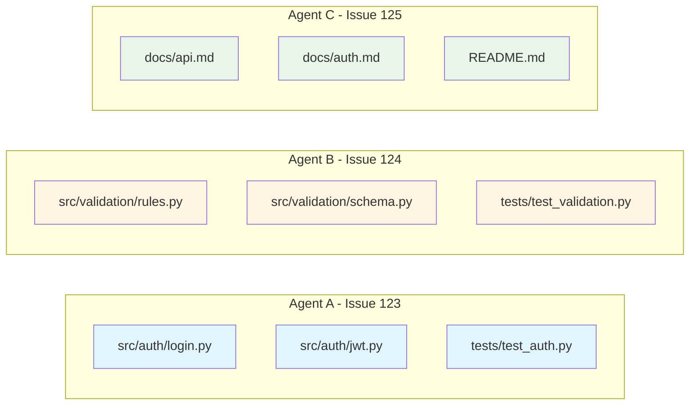

**Rule:** Each agent should only modify files directly related to their issue.

**Example:**
- Agent A (issue #123 - auth): Modifies `src/auth/*.py`, `tests/test_auth.py`
- Agent B (issue #124 - validation): Modifies `src/validation/*.py`, `tests/test_validation.py`
- ✅ No conflicts - different files

### 2. Dependency Management

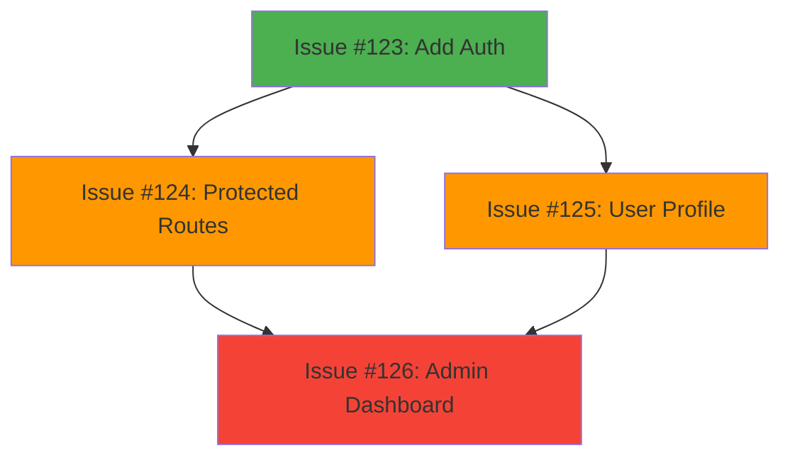

**Rule:** If issue B depends on issue A, issue B must wait until A is merged.

**Example:**
```bash
# Issue #124 depends on #123
gh issue edit 124 --add-label "blocked"
gh issue comment 124 --body "⛔ Blocked by #123 - waiting for auth implementation"

# After #123 merges, unblock #124
gh issue edit 124 --remove-label "blocked" --add-label "status:ready"
```

### 3. Overlapping Changes

**Rule:** If two issues need to modify the same file, coordinate merge order.

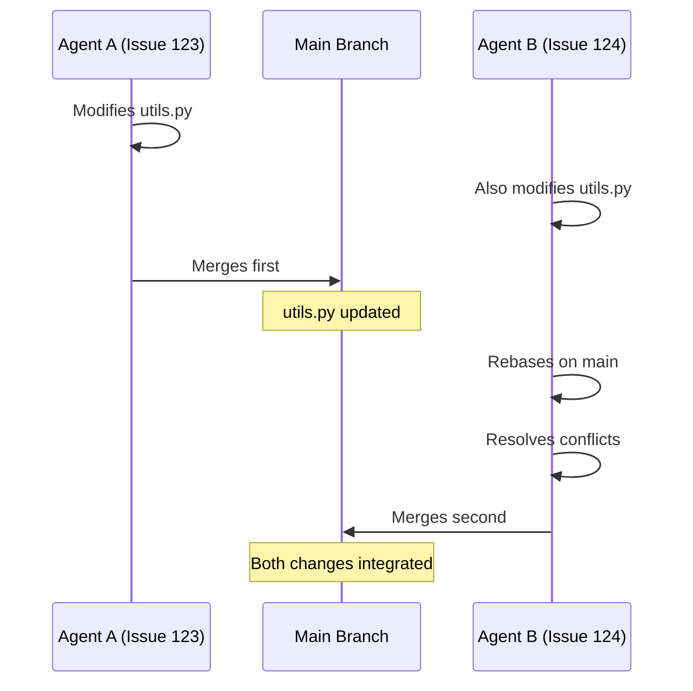

**Example:**
- Issue #123: Adds new function to `utils.py`
- Issue #124: Also modifies `utils.py`

**Solution:**
1. Issue #123 merges first
2. Agent B rebases `agent/124-...` onto latest main
3. Resolves conflicts locally
4. Then merges #124

```bash
# Agent B workflow after #123 merges
git checkout agent/124-fix-validation
git fetch origin
git rebase origin/main
# Resolve any conflicts
git push --force-with-lease origin agent/124-fix-validation
```

### 4. Shared Configuration Files

**Rule:** Minimize agent changes to shared config files.

**Files to avoid unless necessary:**
- `pyproject.toml`
- `requirements.txt` / `uv.lock`
- `.github/workflows/*.yml`
- `config/*.yaml`

**If changes required:**
- Coordinate with other active agents
- Consider separate "infrastructure" issues
- Merge these PRs quickly to unblock others

## Integration with Existing Tools

### Weekly Planner Integration

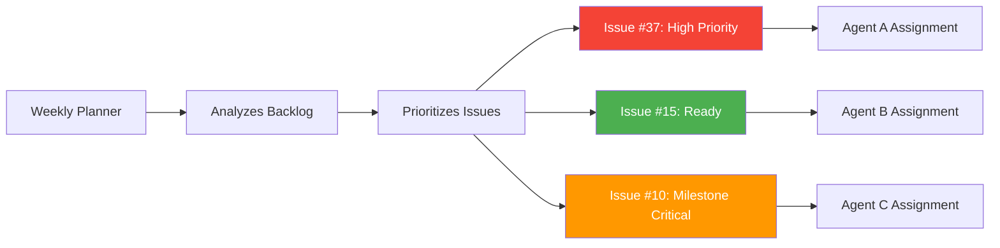

The weekly planner (`workflows/planning/weekly_planner.py`) identifies which issues are ready for agent assignment:

```markdown
SPECIFIC ISSUES TO PRIORITIZE:
1. authentic-advantage #37 - UI Tests Failing (milestone: Q1 Release) ← Agent A
2. chiro #15 - Performance Optimization (status: ready) ← Agent B
3. ai-fundraising-v2 #10 - Data Validation (milestone: MVP) ← Agent C
```

**Agent Assignment:**
```bash
# From weekly plan, assign issues to agents
# Agent A takes #37
/git:issue 37
git checkout -b agent/37-fix-ui-tests

# Agent B takes #15 (different repo, no conflicts)
/git:issue 15
git checkout -b agent/15-performance-optimization

# Agent C takes #10 (different repo, no conflicts)
/git:issue 10
git checkout -b agent/10-data-validation
```

### Commit Analyzer Integration

Track which agents delivered what:

```bash
# Weekly review of agent work
uv run python workflows/code_analysis/commit_report.py \
  --owner mpazaryna \
  --repo chiro \
  --since 2025-11-10 \
  --correlate-issues

# Look for:
# - Which issues had agent commits
# - Quality of commit messages
# - Work distribution across agents
# - Breaking changes introduced
```

### Status Analyzer Integration

Monitor agent progress and bottlenecks:

```bash
# Via weekly planner
uv run python workflows/planning/weekly_planner.py

# Shows:
# - How many issues in "status:in progress" (active agents)
# - How many in "status:in review" (pending merge)
# - Flow health (are agents completing work or stalling?)
```

## Multi-Agent Coordination Rules

### Rule 1: Maximum WIP Limit

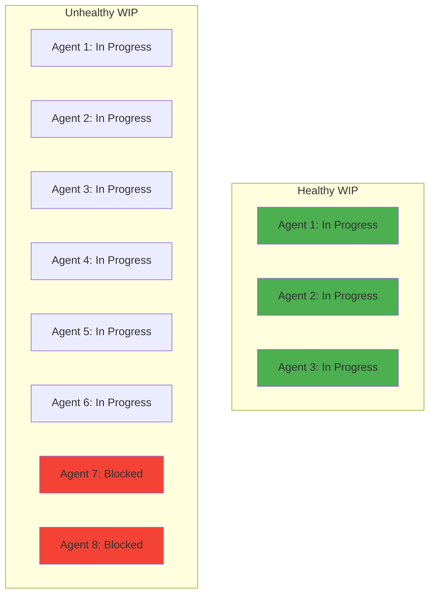

**Don't assign more issues than you can actively manage.**

Recommended:
- 1-3 agents active simultaneously for small teams
- Max 5 agents for larger codebases
- Monitor WIP via status labels

### Rule 2: Agent Assignment Tracking

Maintain a simple tracking file or use GitHub labels:

```bash
# Option 1: GitHub labels
gh label create "agent:a" --color "FF6B6B" --description "Assigned to Agent A"
gh label create "agent:b" --color "4ECDC4" --description "Assigned to Agent B"
gh label create "agent:c" --color "45B7D1" --description "Assigned to Agent C"

# Assign issue to agent
gh issue edit 123 --add-label "agent:a" --add-label "status:in progress"
```

### Rule 3: Daily Sync

Each agent should sync with main daily:

```bash
# Start of work session
git checkout agent/123-add-auth
git fetch origin
git rebase origin/main
# Resolve any conflicts
git push --force-with-lease origin agent/123-add-auth
```

### Rule 4: PR Merge Priority

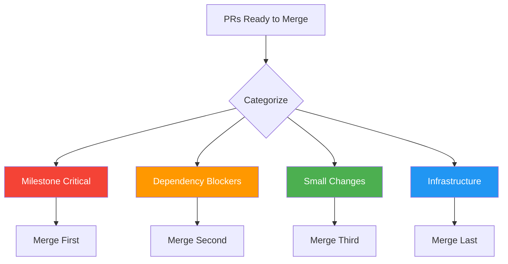

When multiple PRs are ready:
1. **Milestone-critical** issues first
2. **Dependency order** (blockers before blocked)
3. **Smallest changes** first (reduces rebase burden)
4. **Infrastructure** last (requires most coordination)

### Rule 5: Communication

All agents should:
- Comment on issues with progress updates
- Tag blockers immediately
- Request review when PR is ready
- Notify of breaking changes

```bash
# Example: Agent discovers breaking change
gh issue comment 123 --body "⚠️ **Breaking Change Alert**

This PR introduces a breaking change to the Auth API:
- Old: \`authenticate(username, password)\`
- New: \`authenticate(email, password)\`

Migration guide in PR description.

cc: All agents working on auth-dependent features."
```

## Example: 3 Agents, 3 Issues, 1 Codebase

### Scenario
- **Repository:** `chiro`
- **Agents:** A, B, C
- **Issues:** #15, #16, #17 (all marked `status:ready`)

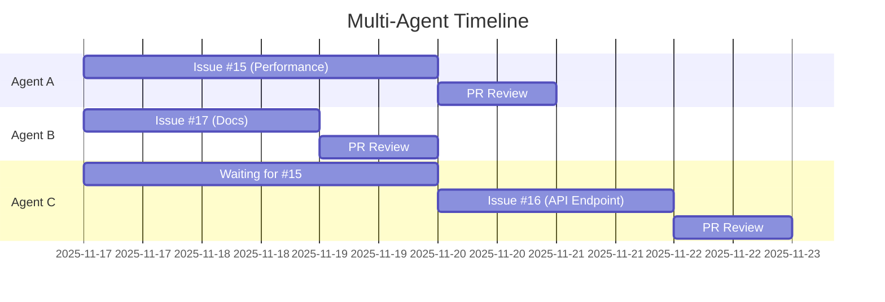

### Kickoff (Monday 9am)

```bash
# Weekly planner already ran, identified these issues:
# Issue #15: Performance optimization (no dependencies)
# Issue #16: Add new API endpoint (depends on #15)
# Issue #17: Update documentation (no dependencies)

# Agent A: Takes #15 (blocker, highest priority)
/git:issue 15
git checkout -b agent/15-performance-optimization
gh issue edit 15 --add-label "status:in progress" --add-label "agent:a"

# Agent B: Takes #17 (non-blocking, independent)
/git:issue 17
git checkout -b agent/17-update-docs
gh issue edit 17 --add-label "status:in progress" --add-label "agent:b"

# Agent C: Waits for #15 to merge before starting #16
gh issue edit 16 --add-label "blocked"
gh issue comment 16 --body "⛔ Blocked by #15 - waiting for performance optimization"
```

### Development (Monday-Wednesday)

```bash
# Agent A: Working on performance
# - Modifies: src/performance/*.py, tests/test_performance.py
# - Commits with conventional format
# - Pushes regularly

# Agent B: Working on docs
# - Modifies: docs/*.md, README.md
# - No code conflicts with Agent A
# - Independent progress

# Agent C: Idle, monitoring #15 progress
```

### Review Phase (Wednesday)

```bash
# Agent A: Completes work
git push origin agent/15-performance-optimization
gh pr create --fill
gh issue edit 15 --remove-label "status:in progress" --add-label "status:in review"

# Agent B: Also completes
git push origin agent/17-update-docs
gh pr create --fill
gh issue edit 17 --remove-label "status:in progress" --add-label "status:in review"
```

### Merge Order (Thursday)

```bash
# 1. Merge #15 first (blocker for #16)
gh pr merge 123 --squash
gh issue close 15

# 2. Unblock Agent C
gh issue edit 16 --remove-label "blocked" --add-label "status:ready"

# 3. Agent C starts work
/git:issue 16
git checkout main && git pull  # Get #15 changes
git checkout -b agent/16-add-api-endpoint
gh issue edit 16 --add-label "status:in progress" --add-label "agent:c"

# 4. Merge #17 (docs, no conflicts)
gh pr merge 124 --squash
gh issue close 17
```

## Monitoring & Observability

### Agent Activity Dashboard

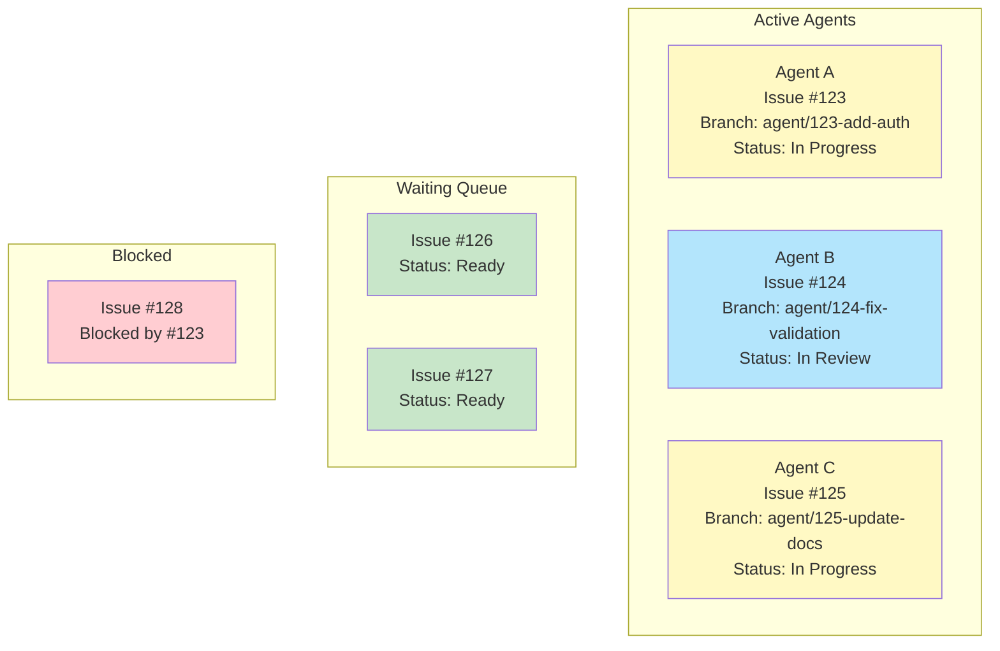

### Track Active Agents

```bash
# See all agent branches
git branch -r | grep agent/

# See all issues in progress (assigned to agents)
gh issue list --label "status:in progress"

# See specific agent's work
gh issue list --label "agent:a"
```

### Weekly Review

```bash
# How many agent-created PRs merged this week?
gh pr list --state merged --search "author:app/github-actions" --created-after="2025-11-10"

# Which issues did agents complete?
gh issue list --state closed --search "closed:>2025-11-10" --label "agent:*"

# Commit analysis for agent work
uv run python workflows/code_analysis/commit_report.py \
  --owner mpazaryna \
  --repo chiro \
  --since 2025-11-10
```

### Health Indicators

**Good Signs:**
- ✅ Issues move through flow: ready → in progress → in review → done
- ✅ Agent branches merge regularly (< 3 days)
- ✅ Minimal conflicts on rebase
- ✅ Conventional commit format maintained

**Warning Signs:**
- ⚠️ Agent branches stale (> 5 days old)
- ⚠️ Many conflicts on rebase
- ⚠️ PRs stuck in review
- ⚠️ Too many "blocked" issues

## Troubleshooting

### Problem: Agent Branch Has Conflicts

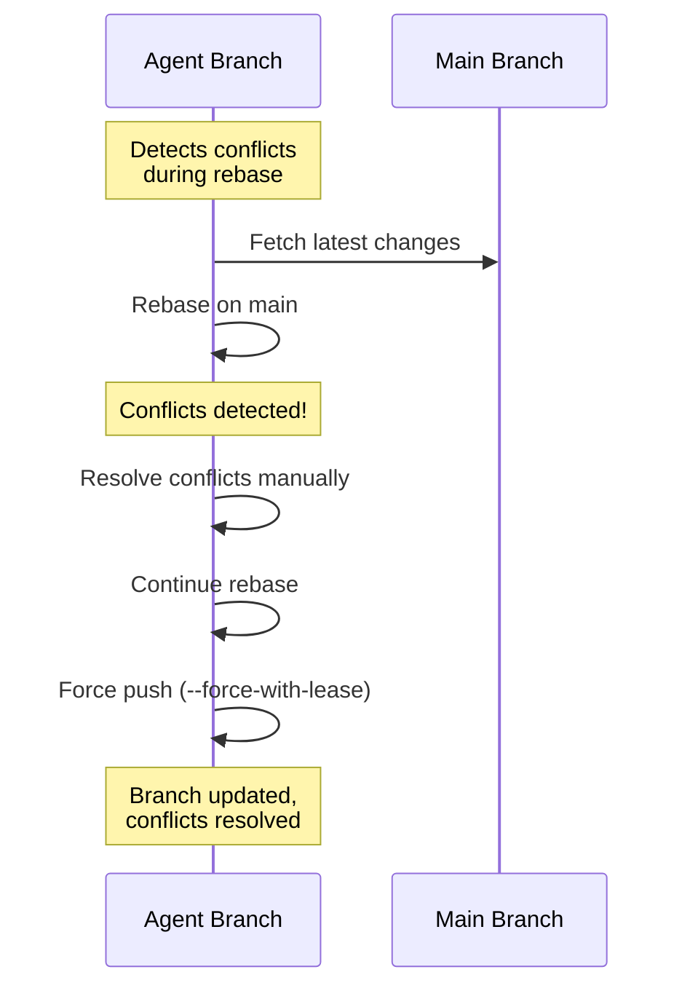

```bash
# Solution: Rebase on latest main
git checkout agent/123-feature
git fetch origin
git rebase origin/main
# Resolve conflicts in editor
git add .
git rebase --continue
git push --force-with-lease origin agent/123-feature
```

### Problem: Two Agents Need Same File

```bash
# Solution: Coordinate merge order
# Agent A's PR merges first
# Agent B rebases and resolves conflicts

# Agent B:
git checkout agent/124-feature
git fetch origin
git rebase origin/main
# Fix conflicts
git push --force-with-lease origin agent/124-feature
```

### Problem: Agent Made Breaking Change

```bash
# Solution: Communicate immediately
gh issue comment 123 --body "⚠️ Breaking change introduced - see PR #456"

# Notify other agents
gh issue list --label "status:in progress" --json number,title
# Manually check which issues might be affected
# Add "blocked" label if necessary
```

### Problem: Too Many Agents, Not Enough Merges

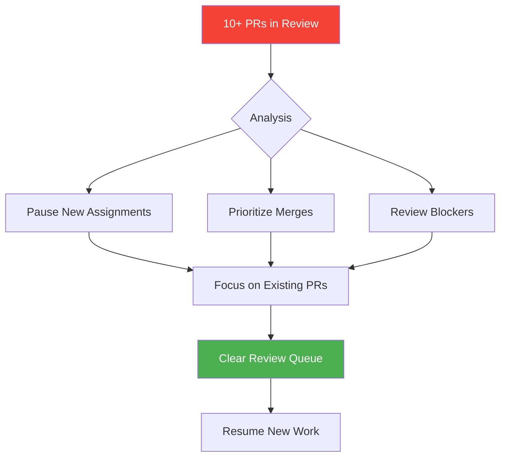

```bash
# Symptom: 10+ issues in "status:in review"
# Solution: Pause new assignments, focus on merging

# Don't start new agent work
# Review and merge existing PRs
# Then resume new assignments once queue clears
```

## Best Practices

### 1. Start Small
- Begin with 1-2 agents on independent issues
- Verify workflow before scaling
- Learn conflict patterns in your codebase

### 2. Clear Scope
- Each issue should have well-defined boundaries
- Avoid "refactor everything" issues
- Break large work into smaller, agent-sized chunks

### 3. Test Before Merge
- Every agent PR must pass CI/CD
- Require test coverage
- Manual review for breaking changes

### 4. Document Agent Behavior
- Track which types of issues agents handle well
- Note common failure patterns
- Improve prompts based on outcomes

### 5. Human Oversight
- Review agent PRs before merging
- Check for security vulnerabilities
- Verify code quality and style

## Future Enhancements

### Phase 1: Manual Agent Assignment (Current)

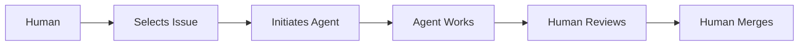

- Human selects issues from weekly plan
- Human initiates agent workflow
- Human reviews and merges

### Phase 2: Semi-Automated Assignment

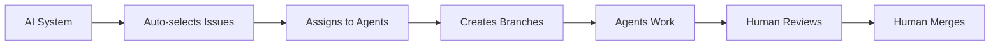

```python
# Auto-assign ready issues to available agents
uv run python workflows/agent_orchestration/auto_assign.py

# Automatically:
# - Selects top priority issues
# - Assigns to available agents
# - Creates branches
# - Updates issue status
```

### Phase 3: Fully Autonomous

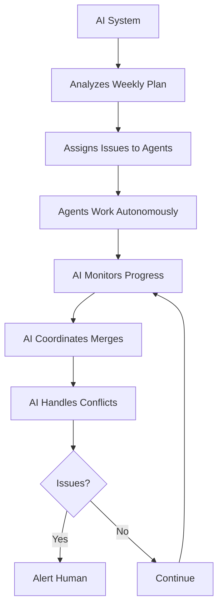

```python
# Fully autonomous workflow
uv run python workflows/agent_orchestration/autonomous_team.py

# AI system:
# 1. Analyzes last week
# 2. Assigns issues to agents based on expertise
# 3. Monitors progress
# 4. Coordinates merge order
# 5. Handles conflicts
# 6. Reports blockers to humans
# 7. Adjusts mid-sprint if needed
```

## Integration with Slash Commands

### `/git:issue` Enhancement

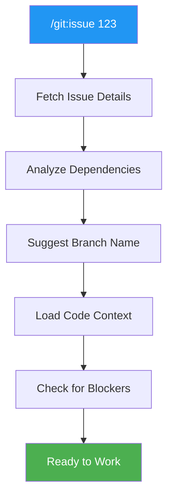

Your existing `/git:issue` command should be the **standard entry point** for all agent work:

```bash
# Current behavior:
/git:issue 123  # Loads issue context

# Enhanced behavior for agents:
/git:issue 123
# → Fetches issue details
# → Suggests branch name: agent/123-short-description
# → Checks for blockers/dependencies
# → Suggests files likely to be modified
# → Loads relevant code context
```

### `/git:commit` Enhancement

```bash
# Current behavior:
/git:commit  # Stages and commits

# Enhanced for agents:
/git:commit
# → Auto-generates conventional commit message
# → References issue number
# → Suggests PR title
```

### `/git:push` Enhancement

```bash
# Current behavior:
/git:push  # Stages, commits, pushes

# Enhanced for agents:
/git:push
# → Pushes to agent branch
# → Offers to create PR
# → Suggests updating issue status
# → Checks for conflicts with other agent branches
```

## Summary

### The multi-agent workflow succeeds when:

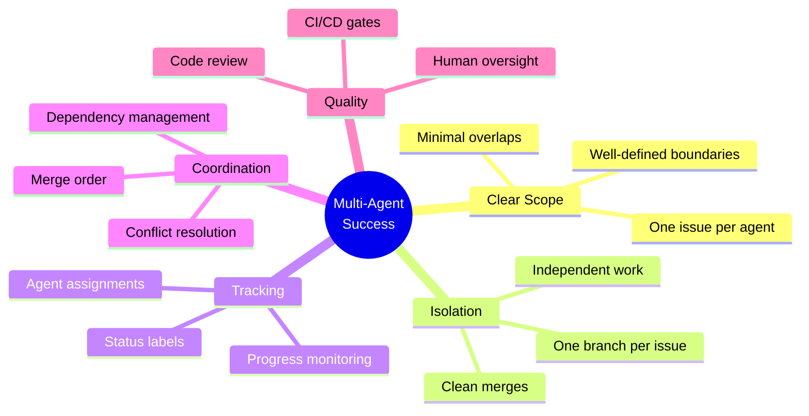

1. ✅ Each agent has a clearly scoped issue
2. ✅ Each issue gets its own branch
3. ✅ Status labels track progress
4. ✅ Conflicts are minimized through isolation
5. ✅ Merge order is coordinated
6. ✅ Human oversight ensures quality

**This enables:**
- Multiple agents working simultaneously
- Safe parallel development
- Clear traceability
- Integration with existing tools
- Scalable automation

---

**Remember:** The goal isn't to replace human judgment, but to augment it. Agents handle the repetitive coding tasks, while you orchestrate the strategy and ensure quality. This workflow makes that division of labor safe and effective.
