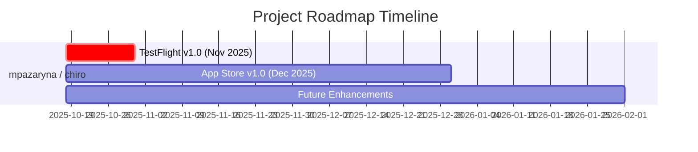

# Project Roadmap

**Generated:** 2025-11-17 16:20:14
**Velocity Sample Period:** Last 30 days

## Summary

- **Total Milestones:** 8
- **Open Milestones:** 8
- **Overdue:** 1 ❌

## Health Status Legend

- ✅ **Good** - On track, progress > 80%
- 🟢 **On Track** - Making good progress
- 🟡 **Behind** - Needs attention (20% buffer exceeded)
- 🟠 **At Risk** - Significant delay predicted (50% buffer exceeded)
- ❌ **Overdue** - Past due date
- ✔️ **Completed** - Milestone closed

## ⚠️ Critical Milestones (Need Attention)

#### ❌ TestFlight v1.0 (Nov 2025)

**Status:** Open
**Progress:** 3/5 issues (60%)
**Due Date:** 2025-10-31
**Days Overdue:** 18
**Predicted Completion:** 2025-11-23 (5 days)
**Current Velocity:** 2.3 issues/week
**❌ Overdue:** This milestone is past its due date

Critical QA and stability for TestFlight beta release

## Milestones by Repository

### mpazaryna/authentic-advantage

**Velocity:** 0.7 issues/week, 6.3 commits/week

#### 📋 VOICE + REIMAGINE Core

**Status:** Open
**Progress:** 0/4 issues (0%)
**Predicted Completion:** 2025-12-27 (39 days)
**Current Velocity:** 0.7 issues/week

Backend-ready quick wins: LinkedIn Post Generator, Professional Bio Generator, Career Possibilities Explorer, Simple Goal Setting. Target: Nov 2025

#### 📋 Phase 3: HIGHLIGHT Dashboard

**Status:** Open
**Progress:** 0/4 issues (0%)
**Predicted Completion:** 2025-12-27 (39 days)
**Current Velocity:** 0.7 issues/week

Skills and achievements visualization: Summary dashboards, bar charts, proficiency tracking. Optional for MVP.

#### 📋 Phase 4: IMPLEMENT + EVOLVE Core

**Status:** Open
**Progress:** 0/4 issues (0%)
**Predicted Completion:** 2025-12-27 (39 days)
**Current Velocity:** 0.7 issues/week

Learning and growth tracking: Learning Path Recommendations, Milestone Tracking, Simple Analytics, Progress Tracking. Target: Dec 2025

#### 📋 Phase 5: Quality & Infrastructure

**Status:** Open
**Progress:** 0/5 issues (0%)
**Predicted Completion:** 2026-01-06 (49 days)
**Current Velocity:** 0.7 issues/week

Technical debt and polish: UI Tests, Test Coverage, Error Handling, User Onboarding, Settings UI

#### 📋 Compass

**Status:** Open
**Progress:** 0/1 issues (0%)
**Predicted Completion:** 2025-11-27 (9 days)
**Current Velocity:** 0.7 issues/week

All items related to CompassKit

### mpazaryna/chiro

**Velocity:** 2.3 issues/week, 20.3 commits/week

#### ❌ TestFlight v1.0 (Nov 2025)

**Status:** Open
**Progress:** 3/5 issues (60%)
**Due Date:** 2025-10-31
**Days Overdue:** 18
**Predicted Completion:** 2025-11-23 (5 days)
**Current Velocity:** 2.3 issues/week
**❌ Overdue:** This milestone is past its due date

Critical QA and stability for TestFlight beta release

#### ✅ App Store v1.0 (Dec 2025)

**Status:** Open
**Progress:** 1/3 issues (33%)
**Due Date:** 2025-12-30
**Days Until Due:** 42
**Predicted Completion:** 2025-11-23 (5 days)
**Current Velocity:** 2.3 issues/week

Polish, visualizations, and TestFlight feedback - ready for general release

#### ✅ Future Enhancements

**Status:** Open
**Progress:** 0/10 issues (0%)
**Due Date:** 2026-02-01
**Days Until Due:** 75
**Predicted Completion:** 2025-12-17 (29 days)
**Current Velocity:** 2.3 issues/week

Post-launch features, research items, and v2.0 planning - no deadline

## Timeline Visualization

